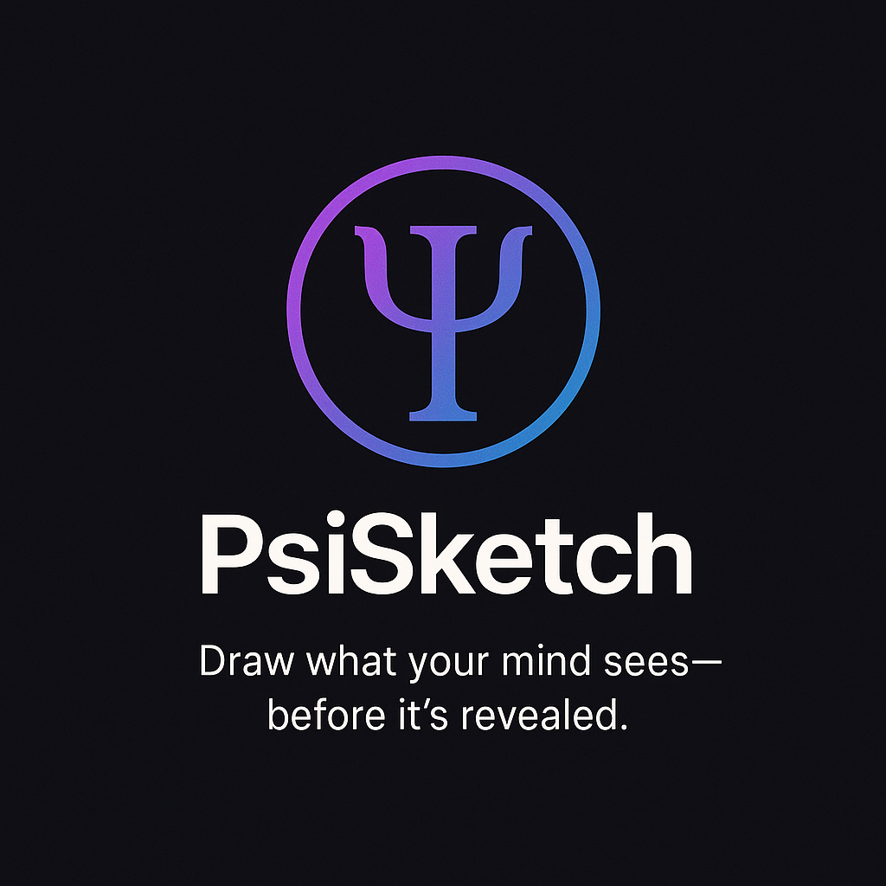
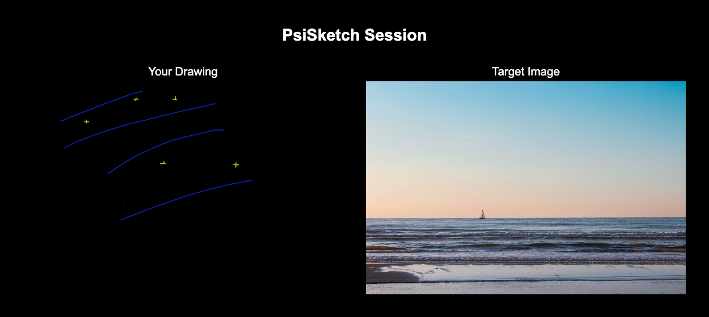
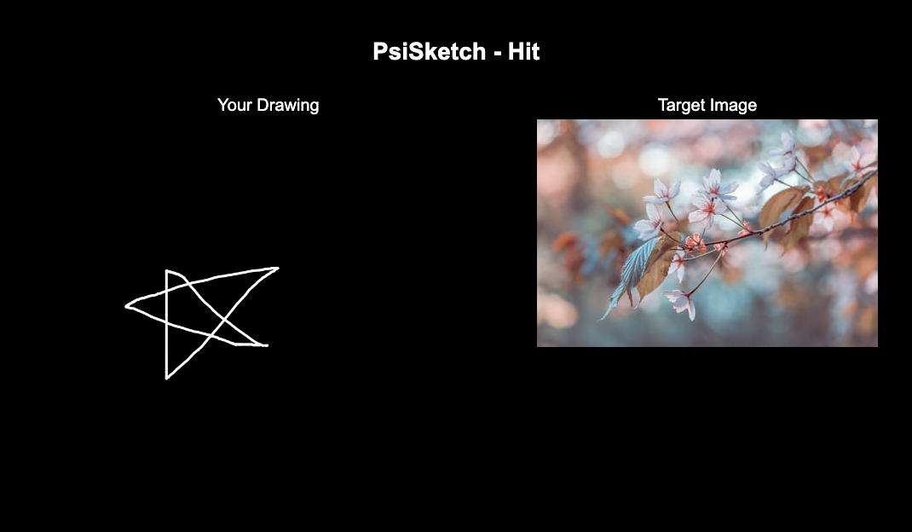
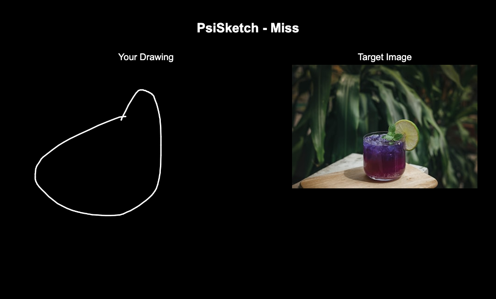
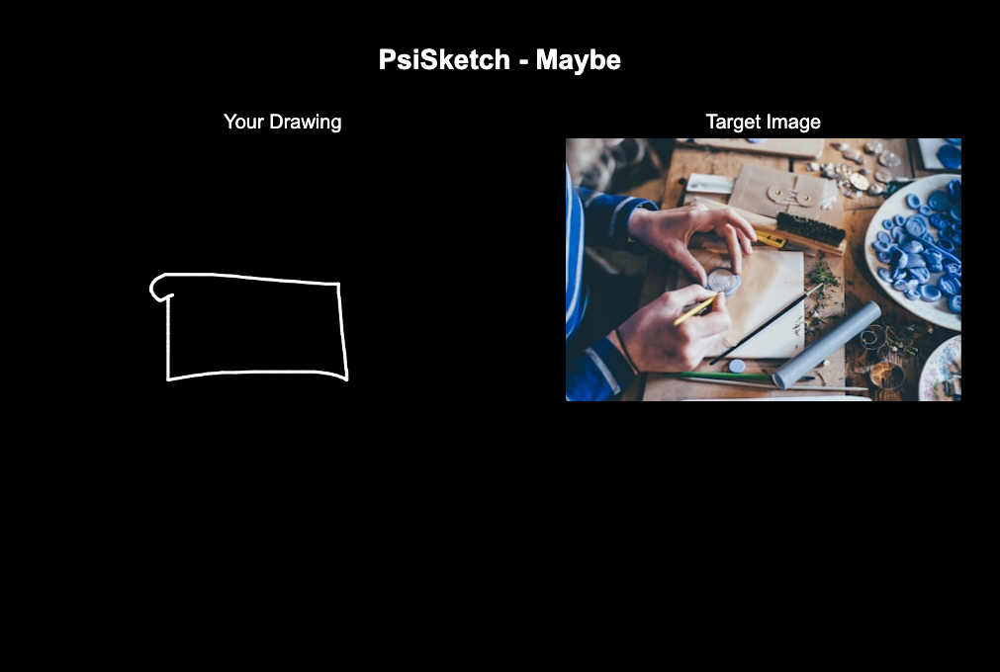

# PsiSketch

A mobile-first remote viewing practice application that helps users explore their intuitive perception abilities through a guided drawing experience.

## 🔮 About PsiSketch

PsiSketch is an interactive web application designed for practicing remote viewing exercises. The app guides users through a structured process:

1. **Breathing Exercise**: Begin with a calming breathing exercise to clear your mind
2. **Drawing Phase**: Draw your impressions of a hidden target image
3. **Reveal Phase**: See the target image and compare it with your drawing
4. **Feedback Loop**: Rate your performance and save notes about your experience

The application keeps track of your practice sessions, allowing you to review past attempts and track your progress over time.

## 🌠 What is Remote Viewing?

Remote viewing is like tuning your mind to a hidden radio signal.
It’s the practice of sensing or “seeing” things that are far away—without using your eyes.

It’s not about guessing.
It’s about listening quietly…
To the subtle impressions that float up from somewhere deeper.

People have used it to explore distant places, hidden objects, and even moments in time.
In PsiSketch, you’ll practice by drawing what you sense—before seeing the real image.

There are no wrong answers.
Only the joy of discovering how much more you can perceive.

🎬 Curious to learn more?
Remote viewing isn’t just imagination—it was studied for decades by scientists and the military.
Watch the documentary [Third Eye Spies (2019)](https://www.imdb.com/title/tt5112424/) to explore its fascinating history:
▶️ [Watch the Trailer](https://youtu.be/iBokQomPr_g?si=1ViGrbPa6cNqUBf-)

## ✨ Features

- **Guided Practice**: Step-by-step interface for remote viewing exercises
- **Drawing Tools**: Simple drawing canvas with color and brush options
- **Random Targets**: Hidden target images randomly selected from various categories
- **Session History**: Review past practice sessions with ratings and notes
- **Side-by-Side Comparison**: Compare your drawing with the target image
- **Shareable Results**: Download and share your results with the community
- **Beautiful UI**: Dark mode interface with intuitive controls
- **Mobile-First**: Optimized for both mobile and desktop experiences
- **Database Integration**: Save your sessions across devices

## 🖼️ Screenshots

  
  
  
  

## 🚀 Technologies Used

- **Frontend**:
  - React with TypeScript
  - Tailwind CSS for styling
  - Fabric.js for canvas drawing

- **Backend**:
  - Node.js with Express
  - PostgreSQL with Drizzle ORM
  - RESTful API architecture

## 🛠️ Getting Started

See the [SETUP.md](SETUP.md) guide for detailed instructions on:
- Downloading the code
- Setting up your development environment
- Deploying to Vercel with a PostgreSQL database

## 🔐 Security Notice

If you previously pushed a `.env` file, immediately rotate the exposed credentials (e.g., Postgres `DATABASE_URL`, `UNSPLASH_API_KEY`) and delete the leaked secret versions from any dashboards. The repository now includes a `.env.example` template; copy it to `.env` locally and keep the real values outside version control.

## 📝 License

This project is licensed under the MIT License - see the LICENSE file for details.

## 🙏 Acknowledgments

- Unsplash for providing the image API
- Replit for the development environment
- Remote Viewing community for inspiration and feedback

## Deploying to Vercel

This project is configured for easy deployment to Vercel.

1.  **Sign up or Log in to Vercel:** Go to [https://vercel.com/](https://vercel.com/).
2.  **Import Project:**
    *   Click on "Add New..." and select "Project".
    *   Import your Git repository.
3.  **Configure Project (Vercel should autodetect settings):**
    *   Vercel will automatically detect the `vercel.json` file and configure the build settings.
    *   The **Root Directory** should be detected as the root of your project. Vercel will use the `vercel.json` to understand that the frontend is in the `client` directory and that the production bundle lives in `dist/public`.
4.  **Set Environment Variables:** In the "Environment Variables" tab add the required secrets (for example `DATABASE_URL` for Postgres and `UNSPLASH_API_KEY` if you use the Unsplash integration). The API can fall back to an in-memory store when `DATABASE_URL` is absent (useful for Preview deployments), but production should provide the real connection string so data persists between requests.
5.  **Deploy:** Click the "Deploy" button.
6.  **Done!** Your application will be deployed, and you'll get a unique URL.

Vercel will use the `vercel.json` file in the root of the project to determine the build command and output directory for the frontend application located in the `client` folder. It also includes routing rules necessary for single-page applications and assumes the built assets are emitted to `dist/public`.

### Deployment readiness plan

1. **Verify environment isolation:** Confirm that all secrets live only in Vercel project settings (or other secret managers) and that local `.env` files stay untracked.
2. **Provision production database:** Run migrations against the managed Postgres instance (e.g., via `npm run db:push`) and confirm connectivity from the serverless function.
3. **Validate build pipeline locally:** Execute `npm run build --prefix client` and `vercel build` to replicate the production build, ensuring `dist/public` is generated with the latest assets.
4. **Smoke-test serverless handlers:** Use `vercel dev` to run the API locally, then redeploy and confirm logs show successful initialization.
5. **Set up monitoring & rotations:** Enable Vercel deployment notifications and schedule regular secret rotations in case credentials are exposed again.
